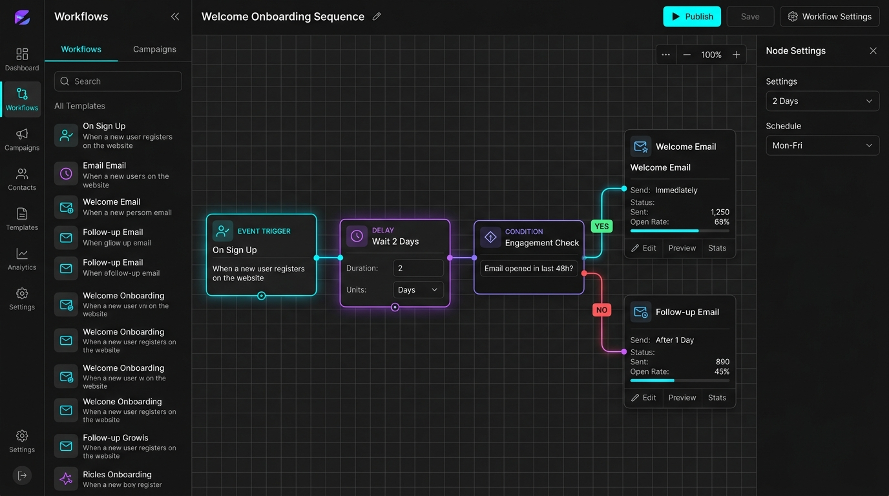

# Email Automation Engine

[](https://github.com/md-emran-hossain/email-automation-engine/actions/workflows/ci.yml)
[](https://opensource.org/licenses/MIT)
[](https://nodejs.org)
[](https://github.com/md-emran-hossain/email-automation-engine/releases)

Email Automation Engine is an open-source platform for building, managing, and running event-driven email automations, built with NestJS, React, PostgreSQL, AWS SES/SQS, and Terraform.



It receives events, matches workflow triggers, moves contacts through automation steps, runs delayed actions, branches on conditions, calls webhooks, and sends workflow emails through AWS SES.

## Features

- **Drag-and-Drop Builder:** Build and organize your email journeys visually using a simple, interactive canvas.
- **Event-Driven Triggers:** Start automatically when users take actions (like sign-up or checkout) in your connected websites or applications.
- **Delays & Scheduling:** Add wait steps (hours, days, or weeks) before executing subsequent actions.
- **Conditional Branching:** Split user paths dynamically based on rules and properties.
- **Smart Email Delivery:** Send via AWS SES with built-in open, click, bounce, and spam tracking.
- **Resilient Webhooks:** Connect external APIs securely with automatic retry logic on failures.
- **Production-Ready Scale:** Built with queue-based workers to handle heavy background traffic.

## Getting Started

Get a local development environment up and running in a few simple steps:

1. **Clone the repository:**
   ```bash
   git clone https://github.com/md-emran-hossain/email-automation-engine.git
   cd email-automation-engine
   ```
2. **Install dependencies:**
   ```bash
   pnpm install
   ```
3. **Set up environment variables:**
   ```bash
   cp .env.example .env
   ```
   _(Update `.env` with your PostgreSQL database credentials and AWS configuration if running SQS)_
4. **Run database migrations:**
   ```bash
   pnpm --filter @email-automation-engine/api migration:run
   ```
5. **Start the services in development mode:**
   ```bash
   pnpm dev
   ```

For deploying to a production AWS environment using Terraform, ECS, and CloudFront, check out the full [Production Cloud Deployment Guide](docs/demo-deployment.md).

## Repository Layout

```text
email-automation-engine/
  apps/
    api/        NestJS backend
    web/        React workflow builder
    worker/     TypeScript workers and Lambda handlers
  packages/
    shared/     shared contracts, schemas, and constants
  infra/
    terraform/  AWS infrastructure modules and examples
  docs/
```

## Documentation

**Start here:** [API Spec](docs/api-spec.md)

**Infrastructure:** [Terraform](docs/terraform.md) · [Queue and Cache](docs/queue-and-cache.md)

**Development:** [Contributing](CONTRIBUTING.md)

## Development Principles

- Keep public code and documentation product-neutral.
- Do not include private product names, domains, account IDs, ARNs, buckets, secrets, or customer data.
- Implement behavior in small, tested vertical slices.
- Keep domain logic independent from queue, cache, and cloud-provider details.
- Treat tests as required implementation artifacts, not follow-up work.

## License

MIT
